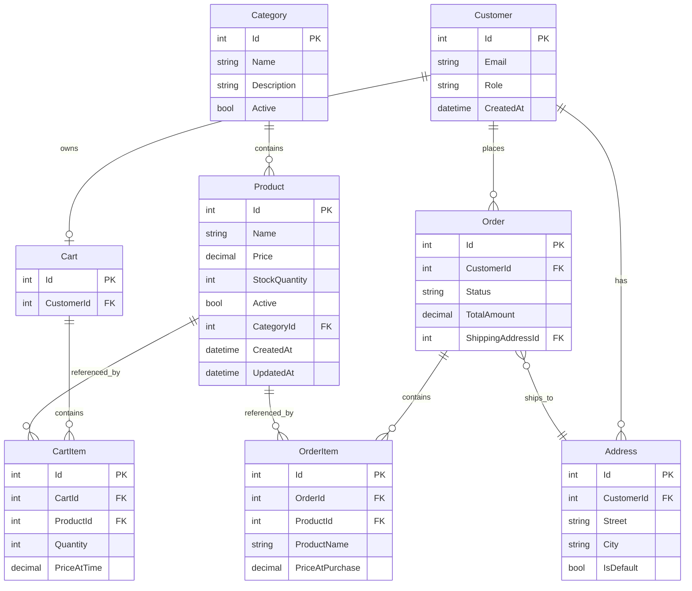

# LCG Shop — Backend developer guide

This guide covers the **domain model**, database relationships, and entity ↔ API mapping for any backend stack. The repository contains the **React frontend** and an **API contract** (OpenAPI). There is **no backend project in this repo yet**.

| Your stack | Connection guide |
|------------|------------------|
| **Java / Spring Boot** | **[JAVA_BACKEND_DEVELOPER.md](./JAVA_BACKEND_DEVELOPER.md)** (recommended for Java devs) |
| C# / ASP.NET | Sections §3, §9 below + [API.md](./API.md) |

You add your own API project (e.g. `lcg-shop-api/`) and connect the frontend when ready.

---

## Table of contents

1. [Get the project](#1-get-the-project)
2. [Run the frontend (mock data)](#2-run-the-frontend-mock-data)
3. [Connect your API step by step](#3-connect-your-api-step-by-step)
4. [What the frontend calls today](#4-what-the-frontend-calls-today)
5. [Domain model (database entities)](#5-domain-model-database-entities)
6. [Database relationships](#6-database-relationships)
7. [Entity vs API contract — discrepancies](#7-entity-vs-api-contract--discrepancies)
8. [Recommended implementation phases](#8-recommended-implementation-phases)
9. [ASP.NET tips](#9-aspnet-tips)
10. [Reference files](#10-reference-files)

---

## 1. Get the project

### Clone

```bash
git clone https://github.com/ChristosAntonopoulos/Eshop.git
cd Eshop
```

If you use SSH:

```bash
git clone git@github.com:ChristosAntonopoulos/Eshop.git
cd Eshop
```

### Repository layout

| Path | Purpose |
|------|---------|
| `lcg-shop-frontend/` | React + TypeScript + Vite storefront |
| `lcg-shop-frontend/docs/openapi.yaml` | Machine-readable API contract |
| `lcg-shop-frontend/docs/API.md` | Short endpoint summary |
| `lcg-shop-frontend/docs/BACKEND_DEVELOPER.md` | This document |
| `azure-pipelines.yml` | CI for the frontend (not the API) |

Your backend can live in the same repo (e.g. `lcg-shop-api/`) or a separate repository. Point `VITE_API_BASE_URL` at your API when testing.

### Prerequisites

| Tool | Version (suggested) |
|------|---------------------|
| Node.js | 20 LTS or newer |
| npm | Comes with Node |
| .NET SDK | 8 or 9 (for your API) |
| SQL Server / PostgreSQL / SQLite | Your choice for EF Core |

---

## 2. Run the frontend (mock data)

The app works **without a backend** using in-memory mock repositories.

```bash
cd lcg-shop-frontend
npm install
cp .env.example .env   # Windows: copy .env.example .env
npm run dev
```

Open **http://localhost:5173**.

Default `.env`:

```env
VITE_USE_MOCK_DATA=true
VITE_USE_MOCK_AUTH=true
VITE_USE_MOCK_ORDERS=true
VITE_API_BASE_URL=http://localhost:8080/api
```

With mocks on, product/category data comes from `src/data/` (admin mutations persist to `localStorage`). Orders use `VITE_USE_MOCK_ORDERS`. The cart is stored in the browser (`localStorage`), not on a server.

### Browse the API contract (Swagger)

```bash
cd lcg-shop-frontend
npm run api-docs
```

Open **http://localhost:3333/api-docs.html** to see every endpoint and schema the frontend expects.

---

## 3. Connect your API step by step

Do **not** try to implement everything at once. Replace mock data with your API in small slices and keep the frontend on mocks until each slice works.

### Step 0 — Create your ASP.NET Web API

- Target: **ASP.NET Core Web API** (.NET 8+).
- Base path: **`/api`** (matches `VITE_API_BASE_URL`, e.g. `http://localhost:8080/api`).
- Enable **CORS** for `http://localhost:5173` in Development.

### Step 1 — Categories only

1. Implement `GET /api/categories` and `GET /api/categories/{slug}` per [openapi.yaml](./openapi.yaml).
2. Seed categories in the database (see [Category](#2-category) below; map `active` → JSON `isActive`, add `slug` for URLs).
3. In `lcg-shop-frontend/.env`:

   ```env
   VITE_USE_MOCK_DATA=false
   VITE_API_BASE_URL=http://localhost:8080/api
   ```

4. Restart `npm run dev`. Category navigation should load from your API; products can still fail until Step 2.

**Repository switch** (automatic when env changes):

```6:8:lcg-shop-frontend/src/services/categories/index.ts
export const categoryRepository = useMockData
  ? mockCategoryRepository
  : httpCategoryRepository;
```

### Step 2 — Products

Implement, in routing order (important):

1. `GET /api/products/featured` — **before** `{slug}` routes
2. `GET /api/products`
3. `GET /api/products/{slug}`
4. `GET /api/products/{id}/related` — **`id` is product id, not slug**

Map your **Product** entity to the **Product DTO** the frontend expects (extra JSON fields are fine; missing required fields will break the UI). See [§7](#7-entity-vs-api-contract--discrepancies).

### Step 3 — Orders (checkout)

`POST /api/orders` is called from `CheckoutPage` via `orderRepository` when `VITE_USE_MOCK_ORDERS=false`. Admin order management uses `GET /orders`, `GET /orders/{id}`, `PATCH /orders/{id}/status`.

### Step 4+ — Auth, admin customers, catalog writes

- Auth: `VITE_USE_MOCK_AUTH=false`
- Admin customers: `GET /admin/customers*` (same auth flag)
- Admin product/category CRUD: same as catalog (`VITE_USE_MOCK_DATA=false`) — see [JAVA_BACKEND_DEVELOPER.md](./JAVA_BACKEND_DEVELOPER.md) §9 and [openapi.yaml](./openapi.yaml)

See [§8 Recommended implementation phases](#8-recommended-implementation-phases).

### Verify integration

| Check | How |
|-------|-----|
| Network calls | Browser DevTools → Network → filter `products`, `categories` |
| Wrong base URL | 404 or CORS errors on `localhost:5173` origin |
| Still on mocks | Confirm `VITE_USE_MOCK_DATA=false` and restart Vite |

---

## 4. What the frontend calls today

| Method | Path | Wired in UI |
|--------|------|-------------|
| `GET` | `/products` (+ admin filters) | Yes |
| `POST` / `PUT` / `PATCH` | `/products…` | Yes (admin) |
| `GET` | `/products/featured` | Yes |
| `GET` | `/products/{slug}` | Yes |
| `GET` | `/products/{id}/related` | Yes |
| `GET` | `/products/by-id/{id}` | Yes (admin) |
| `GET` | `/categories` | Yes |
| `POST` / `PUT` / `PATCH` | `/categories…` | Yes (admin) |
| `GET` | `/categories/{slug}` | Yes |
| `POST` | `/orders` | Yes (checkout) |
| `GET` / `PATCH` | `/orders…` | Yes (admin) |
| `GET` | `/admin/customers*` | Yes (admin) |

HTTP client: `src/services/api/apiClient.ts`  
See also: `httpProductRepository`, `httpCategoryRepository`, `httpOrderRepository`, `httpAdminCustomerRepository`.

Full details: [API.md](./API.md) and [openapi.yaml](./openapi.yaml).

---

## 5. Domain model (database entities)

These are the **persistence entities** you should implement in EF Core. They are the source of truth for your database schema. The React app uses **richer JSON DTOs** for catalog display; map entity → DTO in your API layer (see [§7](#7-entity-vs-api-contract--discrepancies)).

### 1. Product

Represents an item being sold.

| Field | Type | Notes |
|-------|------|--------|
| `Id` | int or Guid | Primary key |
| `Name` | string | Required |
| `Description` | string | Full description |
| `Price` | decimal | Unit price |
| `StockQuantity` | int | ≥ 0 |
| `ImageUrl` | string? | Main image |
| `Active` | bool | In domain docs: `active`; use `Active` in C# |
| `CategoryId` | FK | Required |
| `CreatedAt` | DateTime | UTC recommended |
| `UpdatedAt` | DateTime? | Set on create/update |

**Relations:** Many products → one category.

**Recommended extra columns** (not in the minimal domain list, but required for the current frontend contract):

| Column | Purpose |
|--------|---------|
| `Slug` | URL segment for `GET /products/{slug}` |
| `ShortDescription` | Listing cards |
| `IsFeatured`, `IsNew` | Home / badges |
| `Brand`, `CompareAtPrice`, `Tags`, `GalleryJson` | Optional merchandising |
| `NutritionalInfoJson` | Optional supplement labels |

Store extras in the same table or related tables; expose them in the **Product API DTO**, not necessarily as separate domain “entities.”

---

### 2. Category

For grouping products.

| Field | Type | Notes |
|-------|------|--------|
| `Id` | int or string | PK; frontend uses string ids like `supplements` |
| `Name` | string | e.g. Supplements, Hydration |
| `Description` | string | |
| `Active` | bool | Domain: `active` → API JSON: `isActive` |

**Relations:** One category → many products.

**Recommended extra columns:** `Slug` (often same as `Id`), `ImageUrl` (optional).

Example categories for a **generic** shop (your spec): Electronics, Clothes, Books, Pet Products, Food.  
The **LCG demo frontend** uses fitness categories: Supplements, Protein Snacks, Hydration, Swimming, Accessories, Training — seed what matches your deployment.

---

### 3. Customer / User

Keep simple at first; design for login later.

| Field | Type | Notes |
|-------|------|--------|
| `Id` | int or Guid | PK |
| `FirstName` | string | |
| `LastName` | string | |
| `Email` | string | Unique index |
| `Phone` | string? | |
| `PasswordHash` | string? | Null until auth is implemented |
| `Role` | enum / string | `CUSTOMER` or `ADMIN` |
| `CreatedAt` | DateTime | |

**Roles:**

```csharp
public enum CustomerRole
{
    Customer,  // store as "CUSTOMER" in DB if you prefer strings
    Admin      // "ADMIN"
}
```

You can skip login initially: on checkout, **find or create** a customer by email, then create the order.

---

### 4. Address

Shipping addresses for a customer.

| Field | Type | Notes |
|-------|------|--------|
| `Id` | int or Guid | PK |
| `CustomerId` | FK | |
| `Street` | string | Domain field name |
| `City` | string | |
| `PostalCode` | string | |
| `Country` | string | Default e.g. `GR` |
| `IsDefault` | bool | One default per customer (enforce in app logic) |

**Relations:** One customer → many addresses.

**Checkout API today** sends a single inline address with property `address` (not `street`). Map: `shippingAddress.address` → `Address.Street` when persisting.

---

### 5. Cart

Shopping cart for a customer.

| Field | Type | Notes |
|-------|------|--------|
| `Id` | int or Guid | PK |
| `CustomerId` | FK | Nullable for guest carts (optional phase) |
| `CreatedAt` | DateTime | |
| `UpdatedAt` | DateTime? | |

**Relations:** One customer → one active cart (typical); one cart → many cart items.

**Current frontend:** Cart lives in **browser `localStorage` only**. Server-side `Cart` / `CartItem` tables are for a later phase when you add authenticated or cross-device carts.

---

### 6. CartItem

Line in a cart.

| Field | Type | Notes |
|-------|------|--------|
| `Id` | int or Guid | PK |
| `CartId` | FK | |
| `ProductId` | FK | |
| `Quantity` | int | ≥ 1 |
| `PriceAtTime` | decimal | **Snapshot** of unit price when added |

**Important:** `PriceAtTime` must be set from the product’s current price when the item is added, so totals stay correct if the catalog price changes later.

---

### 7. Order

Finalized purchase.

| Field | Type | Notes |
|-------|------|--------|
| `Id` | int or Guid | PK |
| `CustomerId` | FK | |
| `Status` | enum | See statuses below |
| `TotalAmount` | decimal | Order total (domain field) |
| `ShippingAddressId` | FK | Snapshot address or link to `Address` |
| `CreatedAt` | DateTime | |

**Statuses (domain — use these in the database):**

| Value | Meaning |
|-------|---------|
| `PENDING` | Created, not paid |
| `PAID` | Payment captured |
| `SHIPPED` | Dispatched |
| `DELIVERED` | Completed |
| `CANCELLED` | Cancelled |

**Relations:** One customer → many orders; one order → many order items; order references one shipping address.

**Checkout API response today** uses a smaller status set (`pending`, `confirmed`, `cancelled`) and fields `subtotal`, `shipping`, `total`. Map domain → DTO in the controller until the frontend is updated.

---

### 8. OrderItem

Line in an order.

| Field | Type | Notes |
|-------|------|--------|
| `Id` | int or Guid | PK |
| `OrderId` | FK | |
| `ProductId` | FK | Reference to catalog (may be deleted later) |
| `ProductName` | string | **Snapshot** at purchase time |
| `Quantity` | int | |
| `PriceAtPurchase` | decimal | **Snapshot** unit price |

**Important:** Copy `Product.Name` → `ProductName` and current unit price → `PriceAtPurchase` when the order is placed. Old orders must stay readable even if the product is renamed or repriced.

**Checkout request today** sends `unitPrice` per line (same idea as `PriceAtPurchase`). Also copy `productName` from the product row when saving `OrderItem`.

---

## 6. Database relationships

### Simple overview

```
Category 1 ──< Product
Customer 1 ──< Address
Customer 1 ──< Cart 1 ──< CartItem >── Product
Customer 1 ──< Order 1 ──< OrderItem >── Product
Order ──> Address (shipping)
```

### ER diagram (Mermaid)



---

## 7. Entity vs API contract — discrepancies

There is **no mismatch in the repo’s C# code** (backend not added yet). The table below compares **your domain entities** (§5) with **what the frontend/OpenAPI require today**. Implement entities as specified; **map** to JSON in controllers or AutoMapper profiles.

| Area | Domain entity (your spec) | Frontend / OpenAPI today | Resolution |
|------|---------------------------|---------------------------|------------|
| Product `active` | `Active` (bool) | `isActive` (bool) | Map property name in JSON serializer or DTO |
| Product `updatedAt` | Required in domain | Not in `Product` TS type | Optional in API; safe to omit until frontend adds it |
| Product fields | Core list only | Also `slug`, `shortDescription`, `gallery`, `tags`, `isFeatured`, `isNew`, … | Add DB columns or defaults; map to DTO |
| Category `active` | `Active` | `isActive` | Same as Product |
| Category | No `slug` in spec | `slug` required in API | Add `Slug` column (often equal to `Id`) |
| Category | No `imageUrl` in spec | Optional in API | Add column or omit in JSON |
| Customer | Full entity + `passwordHash`, `role` | Checkout sends inline `customer` without id | Upsert customer on `POST /orders`; don’t return password |
| Address `street` | `Street` | Request field `address` | Map `address` → `Street` on create |
| Address | `country`, `isDefault` | Not in checkout form | Persist with defaults; extend API later |
| Cart / CartItem | Server entities | Client-only `localStorage` | Implement DB tables in a later phase |
| Order `totalAmount` | Single field | Response: `subtotal`, `shipping`, `total` | Compute breakdown in DTO; store `TotalAmount` in DB |
| Order status | `PENDING`, `CONFIRMED`, `SHIPPED`, `DELIVERED`, `CANCELLED` | Same uppercase strings in JSON | Align DB enum with frontend `OrderStatus` |
| OrderItem | `productName`, `priceAtPurchase` | Request: `productId`, `quantity`, `unitPrice` | Load name from Product; save snapshots on order create |
| Order | `shippingAddressId` | Inline `shippingAddress` in body | Create `Address` row, set FK on `Order` |
| Auth | Designed early | Not used | Nullable `PasswordHash`; add JWT/cookies later |

**Verified:** The eight entities in §5 match the specification you provided (Product, Category, Customer, Address, Cart, CartItem, Order, OrderItem) including snapshot fields (`PriceAtTime`, `ProductName`, `PriceAtPurchase`) and order statuses. Gaps are only between that **domain model** and the **catalog/checkout DTOs** the React shop already uses — not between two different domain documents in the repo.

---

## 8. Recommended implementation phases

| Phase | Goal | Frontend setting |
|-------|------|------------------|
| **1** | EF Core models + migrations for Category, Product | `VITE_USE_MOCK_DATA=true` |
| **2** | `GET /categories`, `GET /categories/{slug}` | `false` — test navigation |
| **3** | All `GET /products*` endpoints + seed data | `false` — full catalog |
| **4** | Customer + Address; `POST /orders` + OrderItem snapshots | Test via Swagger; UI still demo |
| **5** | Wire checkout in React (`apiClient.post`) | Coordinate with frontend |
| **6** | Server Cart + CartItem (optional guest id) | New endpoints; frontend change |
| **7** | Auth (`PasswordHash`, roles, JWT) | Admin + customer login |

### Minimal C# entity sketch (aligns with §5)

```csharp
public class Product
{
    public int Id { get; set; }
    public string Name { get; set; } = "";
    public string Description { get; set; } = "";
    public decimal Price { get; set; }
    public int StockQuantity { get; set; }
    public string? ImageUrl { get; set; }
    public bool Active { get; set; } = true;
    public int CategoryId { get; set; }
    public Category Category { get; set; } = null!;
    public DateTime CreatedAt { get; set; }
    public DateTime UpdatedAt { get; set; }
    // Recommended for frontend: Slug, ShortDescription, IsFeatured, IsNew, ...
}

public enum OrderStatus
{
    Pending,
    Paid,
    Shipped,
    Delivered,
    Cancelled
}

public class OrderItem
{
    public int Id { get; set; }
    public int OrderId { get; set; }
    public int ProductId { get; set; }
    public string ProductName { get; set; } = "";      // snapshot
    public int Quantity { get; set; }
    public decimal PriceAtPurchase { get; set; }       // snapshot
}
```

---

## 9. ASP.NET tips

### Routing order

Register **literal** routes before parameterized ones:

```csharp
app.MapGet("/api/products/featured", ...);
app.MapGet("/api/products/{slug}", ...);  // slug, not "featured"
app.MapGet("/api/products/{id}/related", ...);  // id = numeric/string id
```

### CORS (development)

```csharp
builder.Services.AddCors(options =>
{
    options.AddPolicy("Spa", policy =>
        policy.WithOrigins("http://localhost:5173")
              .AllowAnyHeader()
              .AllowAnyMethod());
});
// ...
app.UseCors("Spa");
```

### Ports

| Service | Default URL |
|---------|-------------|
| Vite dev server | `http://localhost:5173` |
| API (suggested) | `http://localhost:8080` with path `/api` |
| Swagger UI (frontend spec) | `http://localhost:3333/api-docs.html` |

### JSON naming

Frontend expects **camelCase** (`isActive`, `stockQuantity`). In ASP.NET Core:

```csharp
builder.Services.ConfigureHttpJsonOptions(o =>
{
    o.SerializerOptions.PropertyNamingPolicy = JsonNamingPolicy.CamelCase;
});
```

Map entity `Active` → DTO property `IsActive` → JSON `isActive`.

### Seeding

Use `mockProducts.ts` / `mockCategories.ts` as **sample JSON** for seed data shapes, not as SQL.

---

## 10. Reference files

| Document | Path |
|----------|------|
| OpenAPI 3.0 (implement this) | [openapi.yaml](./openapi.yaml) |
| Endpoint cheat sheet | [API.md](./API.md) |
| Frontend README | [../README.md](../README.md) |
| Mock → HTTP switch | `../README.md` § “Switching mock → backend” |
| TypeScript DTOs | `../src/features/products/types/product.types.ts` |

When you change an endpoint or DTO, update **openapi.yaml** and ask the frontend team to run:

```bash
npm run sync:openapi
```

---

## Quick checklist for “replace calls with my own”

- [ ] Clone repo, `npm install`, `npm run dev` — confirm UI works with mocks  
- [ ] Open `npm run api-docs` — read all paths  
- [ ] Create ASP.NET API on port 8080, `/api` prefix, CORS for 5173  
- [ ] EF entities per §5 + extras in §7 table  
- [ ] Migrations + seed categories/products  
- [ ] Implement `GET /categories*` → set `VITE_USE_MOCK_DATA=false`  
- [ ] Implement `GET /products*` → verify listing, detail, featured, related  
- [ ] Implement `POST /orders` with snapshots → test in Swagger  
- [ ] Later: auth, server cart, align order status JSON with domain enum  

Questions about frontend behavior: inspect `httpProductRepository.ts`, `httpCategoryRepository.ts`, and `CheckoutPage.tsx`.
